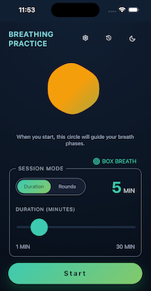
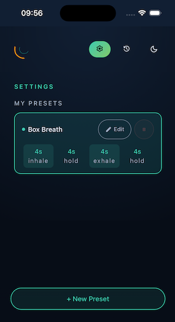
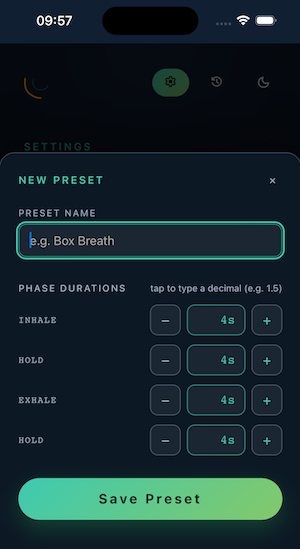
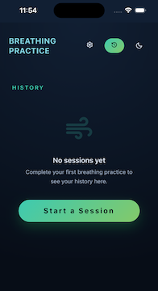

# Breathing Practice



A progressive web app (PWA) for guided breathing exercises. Build custom breathing patterns with configurable inhale, hold, exhale, and hold durations, then run sessions by rounds or total time. Audio cues mark each phase transition. Session history is stored locally — no account or server required.

## Live app

[https://breathing-practice.netlify.app/](https://breathing-practice.netlify.app/)

For the best experience, install it to your phone's home screen:

**iOS (Safari):** tap the Share button → "Add to Home Screen"

**Android (Chrome):** tap the three-dot menu → "Add to Home Screen" (or look for the install prompt in the address bar)

This installs it as a PWA — it runs fullscreen, works offline, and feels like a native app.

## Features

- Customisable breathing presets (inhale / hold-in / exhale / hold-out durations)
- Two session modes: rounds-based or duration-based
- Audio cues for phase transitions
- Session history with localStorage persistence
- Dark / Light / System theme
- PWA — installable, works offline
- Screen wake lock to keep display on during sessions
- Mobile-responsive design

## Tech stack

| Layer      | Technology               |
| ---------- | ------------------------ |
| Framework  | Vue 3 + TypeScript       |
| Build tool | Vite                     |
| State      | Pinia                    |
| Routing    | Vue Router               |
| Testing    | Vitest + @vue/test-utils |
| Linting    | ESLint + oxlint          |
| Formatting | Prettier                 |
| PWA        | vite-plugin-pwa          |

## Prerequisites

- Node.js 20.19.0+ or 22.12.0+
- pnpm

## Getting started

```bash
pnpm install
```

## Dev commands

| Command           | What it does                         |
| ----------------- | ------------------------------------ |
| `pnpm dev`        | Start dev server with HMR            |
| `pnpm build`      | Type-check + production build        |
| `pnpm preview`    | Preview the production build locally |
| `pnpm test:unit`  | Run unit tests (Vitest)              |
| `pnpm type-check` | TypeScript check only (vue-tsc)      |
| `pnpm lint`       | Run all linters (oxlint + ESLint)    |
| `pnpm format`     | Format code with Prettier            |

## Feedback:

Feedback is always welcome! If you have a feature request, notice a bug or think something could be improved feel free to open an "issue" and I'll take a look at it.

## Future/nice to haves:

- Re-think how a preset is set/selected:
  - Have categorised preset breathing patterns (e.g. grounding, energising, calming) so that the user can start a session without having to create presets and without any prior knowledge of breathing practices
  - Identify the different breathing patterns when a user creates a preset and name them automatically (for example 4-4-4-4 is box breathing, 3-3-3-0 is top triangle breathing, 3-0-3-0 is bottom triangle breathing etc.)

- Improve the breathing graphic:
  - Add a border that matches the SVG breathing shape and that shows where the SVG will scale to (up/down) on inhale/exhale and the SVG shape fills that space as it scales. This is to guide a deaf user how long they need to keep inhaling/exhaling for.
  - Add option to change breathing graphic to bell curve graph

- Find a way to use this lovely relaxing soundscape :) https://freesound.org/people/DudeAwesome/sounds/790545/

- Perhaps add a countdown tone so there is instant audio feedback to signify the session start?
